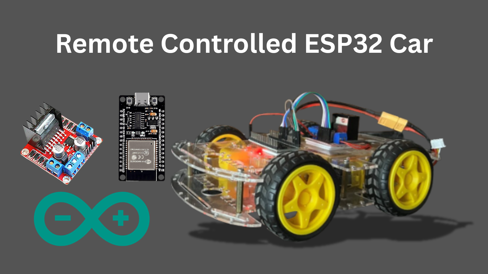

# ESP32-Bluetooth-controlled-robot

---

<p align="center">
  
</p>

---

4 wheel differential drive robot controlled over Bluetooth using ESP32.  
Supports **Classic Bluetooth (SPP)** for Android terminals and **BLE UART** for cross-platform apps.

---

## Features
- Commands: `F,B,L,R,S` + speed `V0..255` + in-place turns.
- PWM motor control with **TB6612FNG** or **L298N**.
- Optional encoders for closed-loop speed.
- Minimal serial protocol. Human-readable. Extensible.
- Arduino IDE or PlatformIO.

---

## Hardware
- ESP32 DevKit (WROOM/WROVER).
- Motor driver: **L298N**.
- 2x DC gear motors, 6–12 V.
- Battery: 2S Li-ion/LiPo with BMS, or 6x NiMH. Step-down 5 V for logic.
- Optional: incremental encoders.

---

## Protocol
- Single-line ASCII commands, newline `\n` terminated.
- `S` stop  
- `F` forward, `B` back  
- `L` left, `R` right  
- `V<0..255>` set speed PWM  
- `T<deg>` in-place turn target (requires encoders; falls back to timed spin)
- `Q` query status → `SPD:<0..255>,BAT:<volts>,MODE:<BLE|SPP>`


---

## 📜 Code

```cpp
#include "BluetoothSerial.h"
BluetoothSerial ESP_BT;

// Define GPIO pins for the L298N motor drivers
#define MOTOR_right_PIN1 13
#define MOTOR_right_PIN2 12
#define MOTOR_left_PIN1 14
#define MOTOR_left_PIN2 27

void setupMotors() {
  pinMode(MOTOR_right_PIN1, OUTPUT);
  pinMode(MOTOR_right_PIN2, OUTPUT);
  pinMode(MOTOR_left_PIN1, OUTPUT);
  pinMode(MOTOR_left_PIN2, OUTPUT);
}

// Function to stop the car
void stopCar() {
  digitalWrite(MOTOR_right_PIN1, LOW);
  digitalWrite(MOTOR_right_PIN2, LOW);
  digitalWrite(MOTOR_left_PIN1, LOW);
  digitalWrite(MOTOR_left_PIN2, LOW);
}

// Function to move the car forward
void moveForward() {
  digitalWrite(MOTOR_right_PIN1, HIGH);
  digitalWrite(MOTOR_right_PIN2, LOW);
  digitalWrite(MOTOR_left_PIN1, HIGH);
  digitalWrite(MOTOR_left_PIN2, LOW);
}

// Function to move the car backward
void moveBackward() {
  digitalWrite(MOTOR_right_PIN1, LOW);
  digitalWrite(MOTOR_right_PIN2, HIGH);
  digitalWrite(MOTOR_left_PIN1, LOW);
  digitalWrite(MOTOR_left_PIN2, HIGH);
}

// Function to turn the car left
void turnLeft() {
  digitalWrite(MOTOR_right_PIN1, HIGH);
  digitalWrite(MOTOR_right_PIN2, LOW);
  digitalWrite(MOTOR_left_PIN1, LOW);
  digitalWrite(MOTOR_left_PIN2, HIGH);
}

// Function to turn the car right
void turnRight() {
  digitalWrite(MOTOR_right_PIN1, LOW);
  digitalWrite(MOTOR_right_PIN2, HIGH);
  digitalWrite(MOTOR_left_PIN1, HIGH);
  digitalWrite(MOTOR_left_PIN2, LOW);
}

void setup() {
  Serial.begin(115200);
  ESP_BT.begin("Thunderbolt");  // Start Bluetooth with the name "Thunderbolt"
  Serial.println("Bluetooth Device is Ready to Pair");
  // Initialize the motor pins
  setupMotors();
  stopCar();
}

void loop() {
  if (ESP_BT.available()) {
    char incoming = ESP_BT.read();
    Serial.print("Received: ");
    Serial.println(incoming);
    
    // Control the car based on the received Bluetooth data
    switch (incoming) {
      case 'F':
        moveForward();
        break;
      case 'B':
        moveBackward();
        break;
      case 'L':
        turnLeft();
        break;
      case 'R':
        turnRight();
        break;
      case 'S':
        stopCar();
        break;
      default:
        break;
    }
  }
  delay(20);  // Delay for stability
}

```

## 👤 About the Author

**Muhammad Saad**  
🎓 Mechatronics and Control Engineering Student  
🏫 University of Engineering and Technology, Lahore  
📍 Lahore, Pakistan  
📧 Email: [msaadmceu@gmail.com](mailto:msaadmceu@gmail.com)
